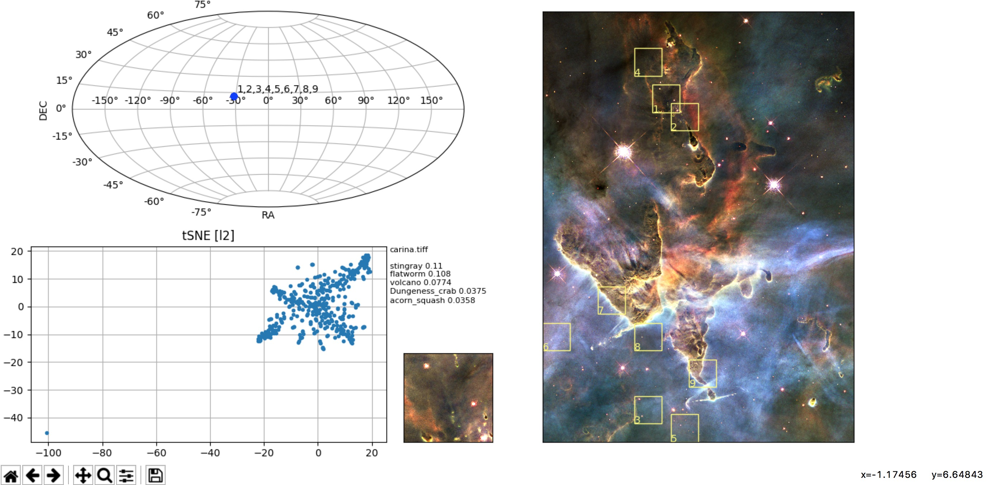

# Summary

Astronomical datasets from ground based and space based telescopes are increasing
in size siginificantlly, for example, LSST will likely consist of petabytes of data
that will be available to the astronomical community. It will be more and more
difficult for astronomers to be able to sift through large amounts of data without
having some automatic method to assist in finding images.

``Elodin-NN`` is a Python package created to calculate a feature vector for 
images or cutouts from an image and then to cluster the feature vectors in order
to group similar images. The feature vectors are created by passing the input
image through a convolutional neural network pre-trained on ImageNet
images. The set of feature vectors for a set of images are then clustered
using a dimensionality reduction algorithm such as t-SNE or UMAP. 

The software provides a framework to be able to do this efficiently. A short
Python script is written to process the data in order to create cutouts automatically
using a sliding window, full frame or blob selection technique. The feature vectors
(aka, fingerprints) are calculated for each cutout and then clustered using t-SNE, UMAP, 
Jaccard set similarity or an L2 distance metric.

Several example scripts and Jupyter notebooks can be found in the `examples` directory.

# Acknowledgements

This work was supported by an internal Director's grant at the Space Telescope Science Institute (D0101.90205).

# References
